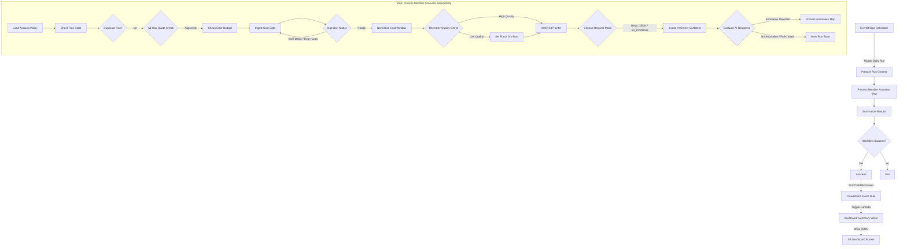
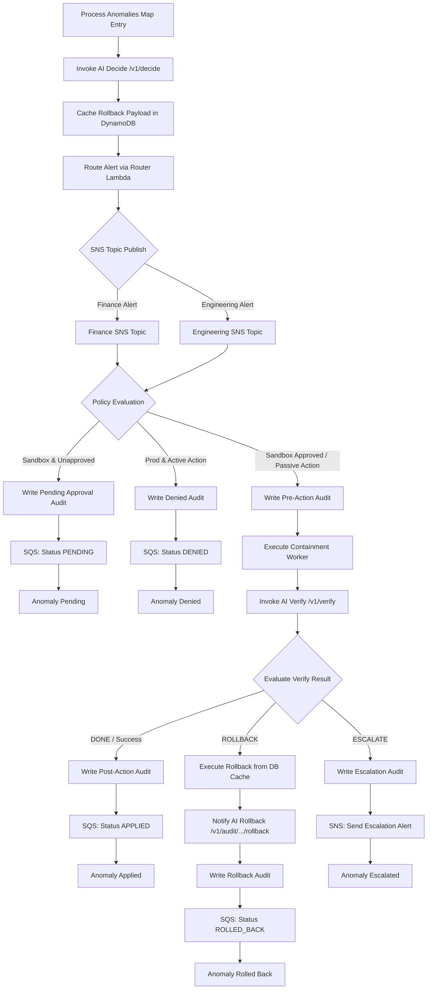
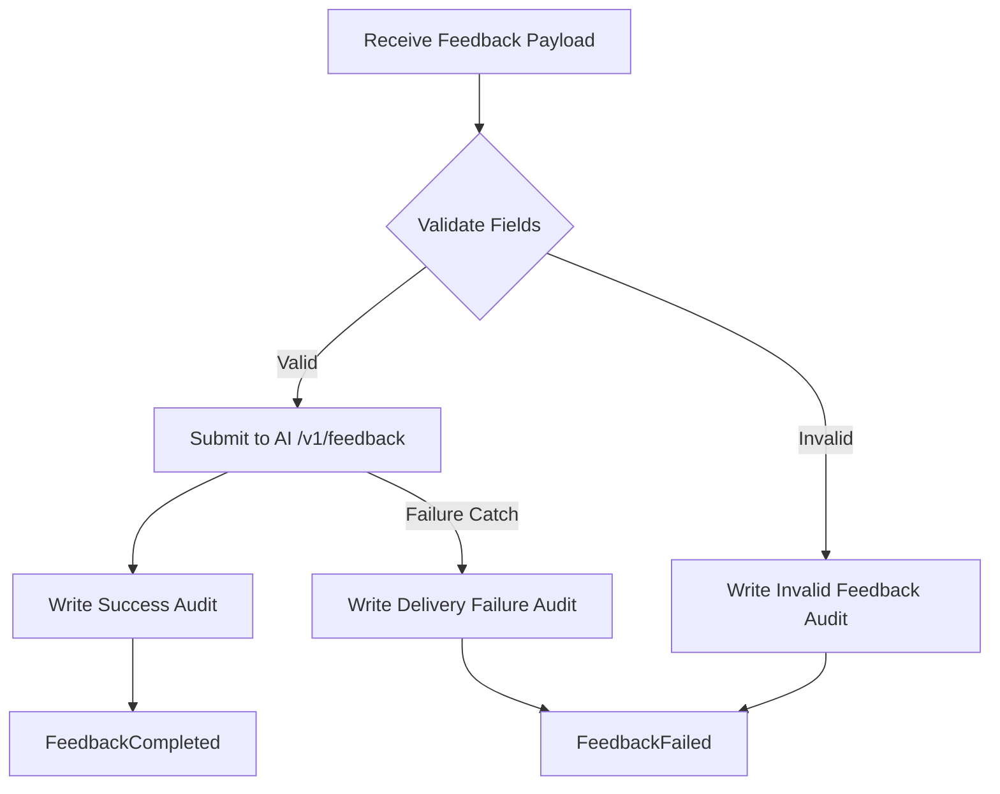

# TF2 FinOps Watch CDO Orchestration Workflow Documentation

This document provides a detailed architectural and operational overview of the serverless orchestration workflows for the **Task Force 2 - FinOps Watch** platform. It details the Step Functions state machines, every individual execution state, the integrated Lambda workers, and the external data stores, messaging queues, and notification systems involved.

---

## 1. Architectural Overview

The orchestration layer is responsible for coordinating the ingestion, normalization, cost anomaly detection, and automated containment lifecycle. It is comprised of two Step Functions state machines:

1. **Daily CDO Workflow (`tf2-finops-{env}-workflow`)**: The primary multi-account daily cost assessment, anomaly detection, policy-driven active/passive containment, and post-action verification loop.
2. **Human Feedback Loop (`tf2-finops-{env}-human-feedback`)**: An asynchronous workflow for SRE or Finance engineers to submit anomaly verdicts (e.g., True Positive, False Positive) back to the AI Engine for model calibration.

Both workflows run within a secure network boundary, interacting with the AI Engine hosted behind a **private internal HTTPS Application Load Balancer (ALB)** via signed AWS IAM SigV4 requests.

### High-Level Workflow Sequence

---

## 2. Daily CDO Workflow States (`statemachine.json`)

### 2.1 Initialization Phase

#### `PrepareRunContext`
* **Type**: `Task`
* **Resource**: `${state_lambda_arn}` (State Management Worker)
* **Parameters**: Runs `"operation": "prepare"`. Includes the raw input, AI contract version (`3.2.0`), default retry limits, and polling intervals.
* **Purpose**: Generates canonical execution parameters such as the `run_id`, `correlation_id`, `execution_date`, and parses the list of target account IDs.
* **Next**: `ProcessAnalysisTargets`

---

### 2.2 Map Phase: Member Account Processing (`ProcessAnalysisTargets`)

* **Type**: `Map`
* **Max Concurrency**: `1` (Enforced sequentially to prevent parallel API rate limiting, throttle member account endpoints, and ensure deterministic audit trails).
* **Iterator Input**: `$.analysis_targets` (List of account IDs and tenant contexts).

#### `LoadAccountPolicy`
* **Type**: `Task`
* **Resource**: Direct DynamoDB Integration (`arn:aws:states:::dynamodb:getItem`)
* **Target**: `${account_policy_table_name}`
* **Purpose**: Fetches the member account configuration policy (e.g., target environment `prod` vs `sandbox`).
* **Next**: `OverwriteEnvironment`

#### `OverwriteEnvironment`
* **Type**: `Pass`
* **Purpose**: Extracts the target environment name from the DB result and maps it into the execution state path `$.environment`.
* **Next**: `CheckRunState`

#### `CheckRunState`
* **Type**: `Task`
* **Resource**: `${state_lambda_arn}` (State Management Worker)
* **Parameters**: Runs `"operation": "check"`.
* **Purpose**: Inspects the `finops-run-state` DynamoDB table to verify if an execution has already run or is running for the given account/date.
* **Next**: `DuplicateRun`

#### `DuplicateRun` (Choice)
* **Rule**: Evaluates `$.state.status`
  * If `COMPLETED`, `IN_PROGRESS`, or `FAILED` -> `AccountDuplicateIgnored` (Succeeds immediately, preventing duplicate run execution).
  * Default -> `CheckAdHocQuotaDecision`

#### `CheckAdHocQuotaDecision` (Choice)
* **Rule**: Checks if `$.is_ad_hoc` is `true`.
  * If `true` -> `CheckAdHocQuota`
  * If `false` -> `CheckErrorBudgetLock`

#### `CheckAdHocQuota`
* **Type**: `Task`
* **Resource**: `${state_lambda_arn}` (State Management Worker)
* **Parameters**: Runs `"operation": "check_quota"`.
* **Purpose**: Enforces tenant-based quotas for manual ad hoc executions (e.g., maximum 5 runs per 24-hour period).
* **Next**: `EvaluateAdHocQuota`

#### `EvaluateAdHocQuota` (Choice)
* **Rule**: Evaluates `$.quota_check.status`.
  * If `QUOTA_EXCEEDED` -> `SetQuotaExceededError` -> `MarkRunFailed`
  * Default -> `CheckErrorBudgetLock`

#### `CheckErrorBudgetLock`
* **Type**: `Task`
* **Resource**: `${state_lambda_arn}` (State Management Worker)
* **Parameters**: Runs `"operation": "check_error_budget"`.
* **Purpose**: Evaluates if the tenant has exceeded its historical error budget. If a budget lock is active, the system automatically defaults all containment execution modes to dry-run.
* **Next**: `EvaluateErrorBudgetLock`

#### `EvaluateErrorBudgetLock`
* **Type**: `Pass`
* **Purpose**: Merges the error budget output (e.g., `locked`, `force_dry_run`) into the execution context.
* **Next**: `IngestCostData`

---

### 2.3 Telemetry Ingestion Phase

#### `IngestCostData`
* **Type**: `Task`
* **Resource**: `${cost_puller_lambda_arn}` (Cost Puller Worker)
* **Purpose**: Fetches telemetries (CUR/Cost Explorer data and cloud resources metadata).
* **Next**: `IngestionReady`

#### `IngestionReady` (Choice)
* **Rule**: Inspects `$.ingestion.status`
  * If `READY` -> `NormalizeCostWindow`
  * If `CUR_DELAY` -> `IncrementCURRetry` (Trigger CUR retry loop).
  * If `CE_THROTTLED` -> `IncrementCERetry` (Trigger Cost Explorer throttling retry loop).
  * Default -> `SetDefaultIngestionError` -> `MarkRunFailed`

#### `IncrementCURRetry` / `CURRetryExceeded`
* **Logic**: Increments retry count. If count >= 4, routes to `SetCURDelayExceededError` -> publishes to SNS Alert topic -> writes audit record -> fails closed. Otherwise, goes to `WaitForCURExport` (Wait state, default 300s) -> loops back to `IngestCostData`.

#### `IncrementCERetry` / `CERetryExceeded`
* **Logic**: Increments retry count. If count >= 3, routes to `SetDefaultIngestionError` -> `MarkRunFailed`. Otherwise, goes to `WaitForCostExplorer` (Wait state, default 300s) -> loops back to `IngestCostData`.

#### `NormalizeCostWindow`
* **Type**: `Task`
* **Resource**: `${normalizer_lambda_arn}` (Telemetry Normalizer Worker)
* **Purpose**: Schema validates and normalizes cost metrics. Saves raw data to the S3 curated lakehouse bucket.
* **Catch**: If normalizer fails, catch state routes to `TriggerCEFallbackFromNormalizationFailure` -> `SetForceCEFallbackFlag` (sets `force_ce_fallback = true` to force fetching Cost Explorer data on the next loop) -> retries `IngestCostData`.

#### `CheckTelemetryQuality` (Choice)
* **Rule**: Evaluates quality parameters: `completeness_score < 0.8`, `delayed_cur = true`, `stale_cost_explorer = true`, `missing_cloudwatch = true`, or `estimated_billing = true`.
  * If any match -> `SetTelemetryForceDryRun` (degrades the run to dry-run mode to prevent automated actions based on incomplete telemetry).
  * Default -> `VerifyS3Pointer`

#### `VerifyS3Pointer` (Choice)
* **Rule**: Ensures a valid gzipped JSON S3 path (`s3://*.json.gz`) is present.
  * If valid -> `ChooseDetectRequestMode`
  * Default -> `SetS3PointerMissingError` -> `FailClosed`

#### `ChooseDetectRequestMode` (Choice)
* **Rule**: Determines if the AI Engine should receive payload references or raw metrics.
  * If `detect_request_mode == "RAW_JSON"` and `telemetry_delay_event == true` -> `BuildDetectRequestRawJson` (Formats payload inline for fallback transmission).
  * Default -> `BuildDetectRequestS3Pointer` (Sends a lightweight S3 object URI link).

---

### 2.4 AI Detection Phase

#### `InvokeDetect`
* **Type**: `Task`
* **Resource**: `${vpc_alb_caller_lambda_arn}` (VPC ALB Caller Worker)
* **Parameters**: Invokes the AI `/v1/detect` endpoint using IAM SigV4 authentication.
* **Timeout**: 60 seconds.
* **Catch**: If AI Engine times out or fails (unresponsive / service down), catch state routes to `FailClosed`.
* **Next**: `EvaluateDetectResponse`

#### `EvaluateDetectResponse` (Choice)
* **Rule**: Parses anomalies list and confidence metrics.
  * If success is `false` or `data_confidence` is `LOW` -> `SetAIFailClosedError` -> `FailClosed`
  * If success is `true` and `anomalies_detected` is `true` -> `ProcessDetectedAnomalies` (Map loop)
  * Default (no anomalies detected) -> `MarkRunComplete`

#### `FailClosed`
* **Type**: `Task`
* **Resource**: `${audit_writer_lambda_arn}` (Audit Writer Worker)
* **Parameters**: Writes a `fail-closed` record in the DynamoDB containment audit table.
* **Next**: `SendFailClosedAlert` (publishes alert via SNS) -> `MarkRunFailed`.

---

### 2.5 Map Phase: Anomaly Processing Loop (`ProcessDetectedAnomalies`)

* **Type**: `Map`
* **Max Concurrency**: `1` (Processes anomalies sequentially to prevent parallel active containment collisions).
* **Iterator Input**: `$.ai_detect_response.anomalies_list`

#### `InvokeDecideForAnomaly`
* **Type**: `Task`
* **Resource**: `${vpc_alb_caller_lambda_arn}`
* **Parameters**: Invokes `/v1/decide` with the unique anomaly context to get an action plan and fallback rollback payload.
* **Next**: `CacheRollbackPayloadForAnomaly`

#### `CacheRollbackPayloadForAnomaly`
* **Type**: `Task`
* **Resource**: Direct DynamoDB Integration (`arn:aws:states:::dynamodb:putItem`)
* **Target**: `${rollback_cache_table_name}`
* **Payload**: Saves the Boto3-equivalent rollback payload mapped to the `anomaly_id`.
* **Next**: `FormatDecideResultForAnomaly` -> `RouteAlertForAnomaly`

#### `RouteAlertForAnomaly`
* **Type**: `Task`
* **Resource**: `${router_lambda_arn}` (Alert Router Worker)
* **Purpose**: Evaluates alerting thresholds and constructs SRE and Finance alert message templates.
* **Next**: `FinanceAlertRequiredForAnomaly`

#### `FinanceAlertRequiredForAnomaly` / `SendFinanceAlertForAnomaly`
* **Choice & Task**: Publishes alert to Finance SNS topic if configured.
* **Next**: `EngineeringAlertRequiredForAnomaly`

#### `EngineeringAlertRequiredForAnomaly` / `SendEngineeringAlertForAnomaly`
* **Choice & Task**: Publishes alert to Engineering SNS topic if configured.
* **Next**: `EvaluateContainmentPolicyForAnomaly`

#### `EvaluateContainmentPolicyForAnomaly` (Choice)
* **Guardrails**:
  1. **Prod Safety Guard**: If `environment == "prod"` and containment action is active (e.g. `terminate`, `delete`, `modify_iam`, `apply`, `auto-shutdown`, `quota-cap`, `time-gated-countdown`), the containment is blocked -> routes to `WriteDeniedAuditForAnomaly`.
  2. **Force Dry-Run Guard**: If `force_dry_run == true` and containment mode is active, the containment is blocked -> routes to `WriteDeniedAuditForAnomaly`.
  3. **Prod Passive Allow**: If `environment == "prod"` and containment mode is passive (e.g. `tag`, `suggest`, `dry-run`, `tag-for-review`), containment proceeds -> routes to `WritePreActionAuditForAnomaly`.
  4. **Sandbox Approved**: If `environment == "sandbox"` and `approval_status == "approved"`, containment proceeds -> routes to `WritePreActionAuditForAnomaly`.
  5. **Sandbox Passive**: If `environment == "sandbox"` and containment mode is passive, containment proceeds -> routes to `WritePreActionAuditForAnomaly`.
  6. **Default (Requires Approval)**: Routes to `WritePendingApprovalAuditForAnomaly`.

#### `WritePreActionAuditForAnomaly` -> `BuildContainmentInputForAnomaly` -> `ExecuteContainmentForAnomaly`
* **Action**: Logs the pre-containment state, formats execution inputs, and runs the `${containment_worker_lambda_arn}` to execute the active/passive action in the target account.
* **Next**: `ReportVerifyResultForAnomaly`

#### `ReportVerifyResultForAnomaly` -> `EvaluateVerifyResultForAnomaly`
* **Action**: Invokes the AI `/v1/verify` endpoint to check if the anomaly is resolved.
* **Choice Branches**:
  * **Success/DONE** -> `WritePostActionAuditForAnomaly` -> `SendAppliedStatusMessageForAnomaly` (SQS queue) -> `AnomalyApplied` (Succeeds iteration).
  * **ROLLBACK** -> `ExecuteRollbackFromCacheForAnomaly` (Runs the containment worker with `execute_rollback` using cached boto3 instructions) -> `NotifyAIRollbackForAnomaly` (Notifies AI engine via `/v1/audit/.../rollback`) -> `WriteRollbackAuditForAnomaly` -> `SendRolledBackStatusMessageForAnomaly` (SQS queue) -> `AnomalyRolledBack` (Ends iteration).
  * **ESCALATE** -> `WriteEscalationAuditForAnomaly` -> `SendEscalationAlertForAnomaly` (SNS Alert) -> `AnomalyEscalated` (Ends iteration).
  * **RETRY** -> Routes to `WritePostActionAuditForAnomaly`.

---

## 3. Human Feedback Workflow States (`feedback_statemachine.json`)

The Feedback State Machine allows out-of-band feedback to recalibrate the model.

### 3.1 Validate Human Feedback
* **Type**: `Choice`
* **Rules**: Validates that `anomaly_id`, `reviewer_id`, `reason`, and `reviewed_at` are present, and that the `verdict` is one of `TRUE_POSITIVE`, `FALSE_POSITIVE`, or `BENIGN_EVENT`.
* **If Invalid** -> `SetInvalidHumanFeedbackError` -> `WriteInvalidHumanFeedbackAudit` -> `FeedbackFailed` (Fail state).
* **If Valid** -> `SubmitHumanFeedback`

### 3.2 Submit Human Feedback
* **Type**: `Task`
* **Resource**: `${vpc_alb_caller_lambda_arn}`
* **Parameters**: Invokes `/v1/feedback` to deliver SRE/Engineer review verdicts to the AI Engine for active-learning calibration.
* **Next**: `WriteHumanFeedbackAudit` -> `FeedbackCompleted` (Succeed state).
* **Catch**: Routes errors to `WriteHumanFeedbackFailureAudit` -> `SetHumanFeedbackDeliveryError` -> `FeedbackFailed`.

---

## 4. Components & AWS Infrastructure Roles

The step function coordinates multiple platform resources:

| Component Name | Resource Type | AWS Configuration & Encryption | Function / Purpose in Workflow |
| :--- | :--- | :--- | :--- |
| **`state`** | Lambda Function | VPC Private Subnet | Performs run initialization, run state checking, ad hoc quota enforcement, error budget evaluation, result summarization, and complete/fail run state flagging. |
| **`cost_puller`** | Lambda Function | VPC Private Subnet | Ingests member account billing and Resource metadata from CUR (primary) or Cost Explorer (fallback). |
| **`normalizer`** | Lambda Function | VPC Private Subnet | Normalizes and schema-validates cost telemetry, writing artifacts to S3 Lakehouse and computing telemetry quality metrics. |
| **`vpc_alb_caller`** | Lambda Function | VPC Private Subnet, IAM SigV4 | Acts as the platform client proxy, sending signed HTTPS API payloads to the private internal ALB that routes to the AI Engine container live alias. |
| **`router`** | Lambda Function | VPC Private Subnet | Evaluates alert routing logic and templates alerting payloads for SRE and Finance. |
| **`containment_worker`** | Lambda Function | VPC Private Subnet | Executes active containment commands (e.g. stop EC2 instances, limit IAM permissions) or rollback sequences. |
| **`audit_writer`** | Lambda Function | VPC Private Subnet | Writes structured execution history and containment audits to S3 (compliance lock) and DynamoDB audit index. |
| **`dashboard_summary_writer`** | Lambda Function | VPC Private Subnet | Invoked asynchronously via EventBridge rule when the daily workflow succeeds. Materializes a unified `dashboard-summary.json` static asset to S3. |
| **DynamoDB Tables** | DynamoDB | KMS-CMK Enabled | Tables include `run-state` (run status), `anomaly` (anomaly lists), `rollback-cache` (rollback JSON), `error-budget` (error margins), `account-policy` (prod/sandbox policy mapping), and `finops-idempotency` (API idempotency). |
| **SNS Topics** | SNS Topic | KMS-CMK Enabled | Alerts topics: `finance_alerts_topic_arn` (Finance updates) and `engineering_alerts_topic_arn` (SRE critical issues). |
| **SQS Status Queue** | SQS Queue | KMS-CMK Enabled | `rollback_status_queue_url` acts as the buffer for alert retry and containment status updates (`APPLIED`, `DENIED`, `PENDING`, `ROLLED_BACK`). |
| **S3 Audit Bucket** | S3 Bucket | Object Lock Compliance Mode | Authoritative evidence store for audit logs and raw/curated lakehouse telemetry. |

---

## 5. Failure Modes & Fail-Closed Guardrails

1. **AI Engine Outage**: If the ALB caller times out, returns HTTP 5xx, or fails schema validation, the workflow **fails closed**: it terminates execution, aborts active containment actions, publishes a high-priority SNS alert to SREs, logs audit evidence, and marks the run failed.
2. **Delayed CUR Ingestion fallback**: If CUR exports are delayed beyond the SLA (36 hours), the `IngestionReady` loop retries up to 4 times. If still delayed, the workflow alerts SREs. It then gracefully falls back to pulling daily Cost Explorer telemetry (running in `RAW_JSON` request mode).
3. **Telemetry Completeness Degradation**: If completeness scores fall below `0.8` or missing CloudWatch metrics are detected, `CheckTelemetryQuality` triggers `force_dry_run = true`. This forces all active containment actions into dry-run mode, permitting alerts while preventing destructive active containment based on stale metrics.
4. **Offline Rollbacks**: The `rollback-cache` DynamoDB table ensures that if the AI Engine dictates a `ROLLBACK` during post-verification but subsequently goes offline, the `containment_worker` can execute the rollback using the locally cached Boto3 payload without needing AI Engine availability.
5. **Accidental Teardown Protection**: To protect staging and production states, S3 buckets, KMS keys, and DynamoDB tables, the modules use a static destroy guard sentinel (`terraform_data.destroy_guard` preventing destroy operations when `destroyable = false`). Sandbox environments override this parameter (`destroyable = true`) to allow developer teardowns.
