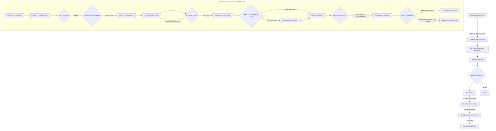
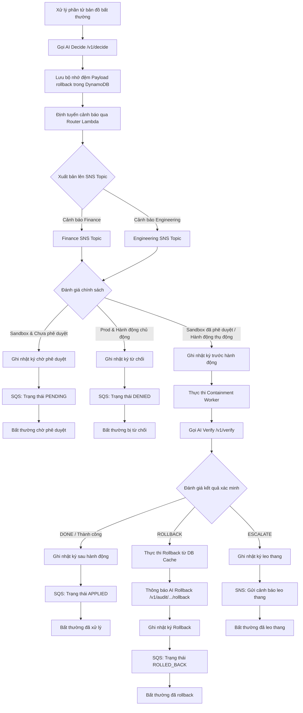
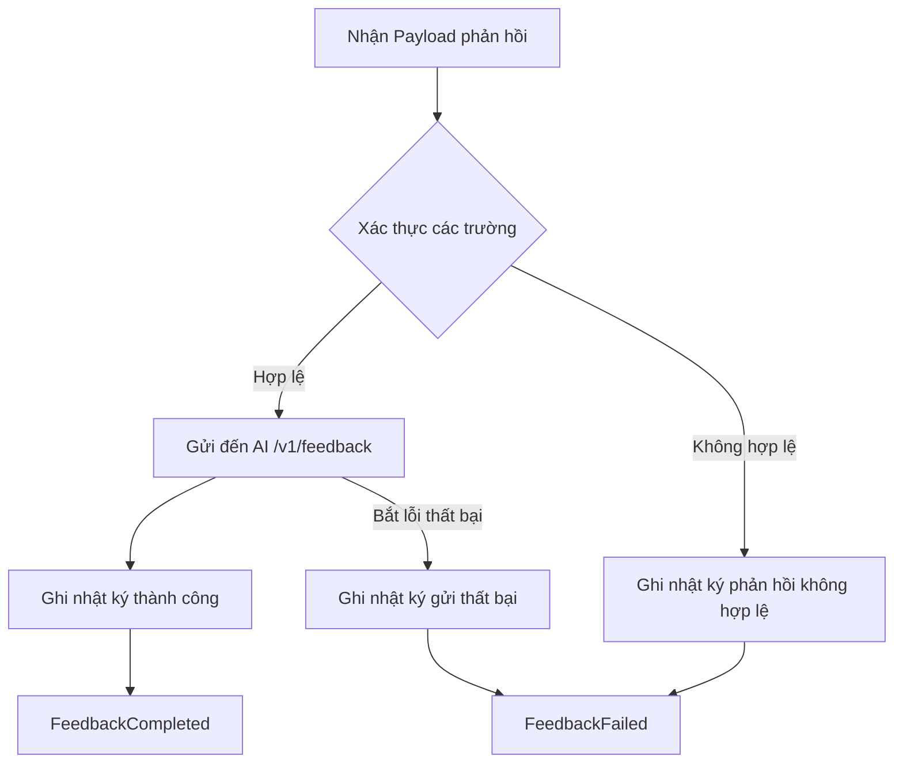

# Tài liệu Quy trình Điều phối CDO TF2 FinOps Watch

Tài liệu này cung cấp cái nhìn tổng quan chi tiết về mặt kiến trúc và vận hành của các quy trình điều phối serverless cho nền tảng **Task Force 2 - FinOps Watch**. Tài liệu chi tiết hóa các Step Functions state machine, từng trạng thái thực thi riêng lẻ, các Lambda worker tích hợp, cũng như các kho lưu trữ dữ liệu ngoài, hàng đợi tin nhắn và hệ thống thông báo liên quan.

---

## 1. Tổng quan Kiến trúc

Lớp điều phối chịu trách nhiệm điều phối toàn bộ vòng đời bao gồm thu nạp, chuẩn hóa dữ liệu, phát hiện bất thường về chi phí và các hành động ngăn chặn tự động. Lớp này bao gồm hai Step Functions state machine:

1. **Quy trình CDO Hằng ngày (`tf2-finops-{env}-workflow`)**: Quy trình đánh giá chi phí hằng ngày trên nhiều tài khoản, phát hiện bất thường, thực thi ngăn chặn chủ động/thụ động theo chính sách, và vòng lặp xác minh sau hành động.
2. **Vòng lặp Phản hồi từ Con người (`tf2-finops-{env}-human-feedback`)**: Một quy trình không đồng bộ để các kỹ sư SRE hoặc Finance gửi đánh giá bất thường (ví dụ: True Positive - Bất thường thực tế, False Positive - Báo động giả) trở lại AI Engine để hiệu chỉnh mô hình.

Cả hai quy trình đều chạy trong một ranh giới mạng bảo mật, tương tác với AI Engine được lưu trữ phía sau một **Application Load Balancer (ALB) HTTPS nội bộ riêng tư** thông qua các yêu cầu được ký AWS IAM SigV4.

### Chuỗi Quy trình Cấp cao

---

## 2. Các Trạng thái trong Quy trình CDO Hằng ngày (`statemachine.json`)

### 2.1 Giai đoạn Khởi tạo

#### `PrepareRunContext`
* **Loại**: `Task`
* **Tài nguyên**: `${state_lambda_arn}` (State Management Worker)
* **Tham số**: Chạy với `"operation": "prepare"`. Bao gồm dữ liệu đầu vào thô, phiên bản hợp đồng AI (`3.2.0`), giới hạn thử lại mặc định và khoảng thời gian thăm dò.
* **Mục đích**: Tạo ra các tham số thực thi chuẩn hóa như `run_id`, `correlation_id`, `execution_date`, và phân tích danh sách các AWS Account ID mục tiêu.
* **Trạng thái tiếp theo**: `ProcessAnalysisTargets`

---

### 2.2 Giai đoạn Bản đồ: Xử lý Tài khoản Thành viên (`ProcessAnalysisTargets`)

* **Loại**: `Map`
* **Mức độ song song tối đa (Max Concurrency)**: `1` (Bắt buộc thực hiện tuần tự để ngăn ngừa giới hạn tần suất API song song, điều tiết các endpoint của tài khoản thành viên và đảm bảo nhật ký kiểm toán mang tính xác định).
* **Đầu vào vòng lặp (Iterator Input)**: `$.analysis_targets` (Danh sách các Account ID và ngữ cảnh tenant).

#### `LoadAccountPolicy`
* **Loại**: `Task`
* **Tài nguyên**: Tích hợp trực tiếp với DynamoDB (`arn:aws:states:::dynamodb:getItem`)
* **Đích**: `${account_policy_table_name}`
* **Mục đích**: Lấy chính sách cấu hình của tài khoản thành viên (ví dụ: môi trường đích `prod` so với `sandbox`).
* **Trạng thái tiếp theo**: `OverwriteEnvironment`

#### `OverwriteEnvironment`
* **Loại**: `Pass`
* **Mục đích**: Trích xuất tên môi trường mục tiêu từ kết quả DB và ánh xạ nó vào đường dẫn trạng thái thực thi `$.environment`.
* **Trạng thái tiếp theo**: `CheckRunState`

#### `CheckRunState`
* **Loại**: `Task`
* **Tài nguyên**: `${state_lambda_arn}` (State Management Worker)
* **Tham số**: Chạy với `"operation": "check"`.
* **Mục đích**: Kiểm tra bảng DynamoDB `finops-run-state` để xác minh xem một lượt chạy đã được thực hiện hoặc đang chạy cho tài khoản/ngày đó hay chưa.
* **Trạng thái tiếp theo**: `DuplicateRun`

#### `DuplicateRun` (Lựa chọn - Choice)
* **Quy tắc**: Đánh giá `$.state.status`
  * Nếu là `COMPLETED`, `IN_PROGRESS`, hoặc `FAILED` -> `AccountDuplicateIgnored` (Thành công ngay lập tức, ngăn chặn chạy trùng lặp).
  * Mặc định -> `CheckAdHocQuotaDecision`

#### `CheckAdHocQuotaDecision` (Lựa chọn - Choice)
* **Quy tắc**: Kiểm tra xem `$.is_ad_hoc` có phải là `true` hay không.
  * Nếu là `true` -> `CheckAdHocQuota`
  * Nếu là `false` -> `CheckErrorBudgetLock`

#### `CheckAdHocQuota`
* **Loại**: `Task`
* **Tài nguyên**: `${state_lambda_arn}` (State Management Worker)
* **Tham số**: Chạy với `"operation": "check_quota"`.
* **Mục đích**: Áp dụng hạn ngạch (quota) theo tenant cho các lượt chạy thủ công ad hoc (ví dụ: tối đa 5 lượt chạy trong vòng 24 giờ).
* **Trạng thái tiếp theo**: `EvaluateAdHocQuota`

#### `EvaluateAdHocQuota` (Lựa chọn - Choice)
* **Quy tắc**: Đánh giá `$.quota_check.status`.
  * Nếu là `QUOTA_EXCEEDED` -> `SetQuotaExceededError` -> `MarkRunFailed`
  * Mặc định -> `CheckErrorBudgetLock`

#### `CheckErrorBudgetLock`
* **Loại**: `Task`
* **Tài nguyên**: `${state_lambda_arn}` (State Management Worker)
* **Tham số**: Chạy với `"operation": "check_error_budget"`.
* **Mục đích**: Đánh giá xem tenant có vượt quá ngân sách lỗi (error budget) lịch sử hay không. Nếu khóa ngân sách đang hoạt động, hệ thống sẽ tự động chuyển tất cả các chế độ thực thi ngăn chặn thành dry-run.
* **Trạng thái tiếp theo**: `EvaluateErrorBudgetLock`

#### `EvaluateErrorBudgetLock`
* **Loại**: `Pass`
* **Mục đích**: Hợp nhất đầu ra của ngân sách lỗi (ví dụ: `locked`, `force_dry_run`) vào ngữ cảnh thực thi.
* **Trạng thái tiếp theo**: `IngestCostData`

---

### 2.3 Giai đoạn Thu nạp Dữ liệu Đo lường (Telemetry Ingestion)

#### `IngestCostData`
* **Loại**: `Task`
* **Tài nguyên**: `${cost_puller_lambda_arn}` (Cost Puller Worker)
* **Mục đích**: Thu thập các dữ liệu đo lường (dữ liệu CUR/Cost Explorer và siêu dữ liệu tài nguyên đám mây).
* **Trạng thái tiếp theo**: `IngestionReady`

#### `IngestionReady` (Lựa chọn - Choice)
* **Quy tắc**: Kiểm tra `$.ingestion.status`
  * Nếu là `READY` -> `NormalizeCostWindow`
  * Nếu là `CUR_DELAY` -> `IncrementCURRetry` (Kích hoạt vòng lặp thử lại khi CUR trễ).
  * Nếu là `CE_THROTTLED` -> `IncrementCERetry` (Kích hoạt vòng lặp thử lại khi Cost Explorer bị giới hạn tần suất - throttled).
  * Mặc định -> `SetDefaultIngestionError` -> `MarkRunFailed`

#### `IncrementCURRetry` / `CURRetryExceeded`
* **Logic**: Tăng số lần thử lại. Nếu số lần >= 4, chuyển hướng đến `SetCURDelayExceededError` -> xuất bản lên SNS Alert topic -> ghi nhật ký kiểm toán -> fail closed (đóng an toàn). Ngược lại, chuyển sang `WaitForCURExport` (trạng thái chờ, mặc định 300 giây) -> lặp lại bước `IngestCostData`.

#### `IncrementCERetry` / `CERetryExceeded`
* **Logic**: Tăng số lần thử lại. Nếu số lần >= 3, chuyển hướng đến `SetDefaultIngestionError` -> `MarkRunFailed`. Ngược lại, chuyển sang `WaitForCostExplorer` (trạng thái chờ, mặc định 300 giây) -> lặp lại bước `IngestCostData`.

#### `NormalizeCostWindow`
* **Loại**: `Task`
* **Tài nguyên**: `${normalizer_lambda_arn}` (Telemetry Normalizer Worker)
* **Mục đích**: Xác thực lược đồ (schema) và chuẩn hóa các chỉ số chi phí. Lưu dữ liệu thô vào S3 curated lakehouse bucket.
* **Catch**: Nếu bước chuẩn hóa thất bại, trạng thái bắt lỗi (catch state) sẽ chuyển hướng đến `TriggerCEFallbackFromNormalizationFailure` -> `SetForceCEFallbackFlag` (đặt `force_ce_fallback = true` để buộc lấy dữ liệu Cost Explorer ở vòng lặp tiếp theo) -> thử lại `IngestCostData`.

#### `CheckTelemetryQuality` (Lựa chọn - Choice)
* **Quy tắc**: Đánh giá các tham số chất lượng: `completeness_score < 0.8`, `delayed_cur = true`, `stale_cost_explorer = true`, `missing_cloudwatch = true`, hoặc `estimated_billing = true`.
  * Nếu bất kỳ điều kiện nào khớp -> `SetTelemetryForceDryRun` (hạ cấp lượt chạy xuống chế độ dry-run để ngăn chặn các hành động tự động dựa trên dữ liệu đo lường không đầy đủ).
  * Mặc định -> `VerifyS3Pointer`

#### `VerifyS3Pointer` (Lựa chọn - Choice)
* **Quy tắc**: Đảm bảo có đường dẫn S3 của tệp JSON đã nén gzip hợp lệ (`s3://*.json.gz`).
  * Nếu hợp lệ -> `ChooseDetectRequestMode`
  * Mặc định -> `SetS3PointerMissingError` -> `FailClosed`

#### `ChooseDetectRequestMode` (Lựa chọn - Choice)
* **Quy tắc**: Xác định xem AI Engine nên nhận tham chiếu payload (payload references) hay chỉ số thô (raw metrics).
  * Nếu `detect_request_mode == "RAW_JSON"` và `telemetry_delay_event == true` -> `BuildDetectRequestRawJson` (Định dạng payload nội tuyến - inline để truyền dự phòng).
  * Mặc định -> `BuildDetectRequestS3Pointer` (Gửi liên kết URI đối tượng S3 dung lượng nhẹ).

---

### 2.4 Giai đoạn Phát hiện bằng AI (AI Detection Phase)

#### `InvokeDetect`
* **Loại**: `Task`
* **Tài nguyên**: `${vpc_alb_caller_lambda_arn}` (VPC ALB Caller Worker)
* **Tham số**: Gọi endpoint AI `/v1/detect` bằng cách sử dụng xác thực IAM SigV4.
* **Thời gian chờ (Timeout)**: 60 giây.
* **Catch**: Nếu AI Engine hết thời gian chờ hoặc thất bại (không phản hồi / dịch vụ bị sập), trạng thái bắt lỗi chuyển hướng đến `FailClosed`.
* **Trạng thái tiếp theo**: `EvaluateDetectResponse`

#### `EvaluateDetectResponse` (Lựa chọn - Choice)
* **Quy tắc**: Phân tích danh sách bất thường và chỉ số độ tin cậy.
  * Nếu thành công là `false` hoặc `data_confidence` là `LOW` -> `SetAIFailClosedError` -> `FailClosed`
  * Nếu thành công là `true` và `anomalies_detected` là `true` -> `ProcessDetectedAnomalies` (Vòng lặp Map)
  * Mặc định (không phát hiện bất thường) -> `MarkRunComplete`

#### `FailClosed`
* **Loại**: `Task`
* **Tài nguyên**: `${audit_writer_lambda_arn}` (Audit Writer Worker)
* **Tham số**: Ghi bản ghi `fail-closed` vào bảng kiểm toán ngăn chặn (containment audit) trong DynamoDB.
* **Trạng thái tiếp theo**: `SendFailClosedAlert` (xuất bản cảnh báo qua SNS) -> `MarkRunFailed`.

---

### 2.5 Giai đoạn Bản đồ: Vòng lặp Xử lý Bất thường (`ProcessDetectedAnomalies`)

* **Loại**: `Map`
* **Mức độ song song tối đa (Max Concurrency)**: `1` (Xử lý các bất thường một cách tuần tự để ngăn chặn xung đột hành động ngăn chặn chủ động song song).
* **Đầu vào vòng lặp (Iterator Input)**: `$.ai_detect_response.anomalies_list`

#### `InvokeDecideForAnomaly`
* **Loại**: `Task`
* **Tài nguyên**: `${vpc_alb_caller_lambda_arn}`
* **Tham số**: Gọi `/v1/decide` với ngữ cảnh bất thường duy nhất để nhận kế hoạch hành động và payload rollback dự phòng.
* **Trạng thái tiếp theo**: `CacheRollbackPayloadForAnomaly`

#### `CacheRollbackPayloadForAnomaly`
* **Loại**: `Task`
* **Tài nguyên**: Tích hợp trực tiếp với DynamoDB (`arn:aws:states:::dynamodb:putItem`)
* **Đích**: `${rollback_cache_table_name}`
* **Payload**: Lưu payload rollback tương đương Boto3 được ánh xạ tới `anomaly_id`.
* **Trạng thái tiếp theo**: `FormatDecideResultForAnomaly` -> `RouteAlertForAnomaly`

#### `RouteAlertForAnomaly`
* **Loại**: `Task`
* **Tài nguyên**: `${router_lambda_arn}` (Alert Router Worker)
* **Mục đích**: Đánh giá các ngưỡng cảnh báo và xây dựng các mẫu tin nhắn cảnh báo cho SRE và Finance.
* **Trạng thái tiếp theo**: `FinanceAlertRequiredForAnomaly`

#### `FinanceAlertRequiredForAnomaly` / `SendFinanceAlertForAnomaly`
* **Lựa chọn & Task**: Xuất bản cảnh báo tới Finance SNS topic nếu được cấu hình.
* **Trạng thái tiếp theo**: `EngineeringAlertRequiredForAnomaly`

#### `EngineeringAlertRequiredForAnomaly` / `SendEngineeringAlertForAnomaly`
* **Lựa chọn & Task**: Xuất bản cảnh báo tới Engineering SNS topic nếu được cấu hình.
* **Trạng thái tiếp theo**: `EvaluateContainmentPolicyForAnomaly`

#### `EvaluateContainmentPolicyForAnomaly` (Lựa chọn - Choice)
* **Rào chắn bảo vệ (Guardrails)**:
  1. **Bảo vệ môi trường Prod**: Nếu `environment == "prod"` và hành động ngăn chặn là chủ động (ví dụ: `terminate`, `delete`, `modify_iam`, `apply`, `auto-shutdown`, `quota-cap`, `time-gated-countdown`), hành động ngăn chặn bị chặn -> chuyển hướng đến `WriteDeniedAuditForAnomaly`.
  2. **Bảo vệ Force Dry-Run**: Nếu `force_dry_run == true` và chế độ ngăn chặn là chủ động, hành động ngăn chặn bị chặn -> chuyển hướng đến `WriteDeniedAuditForAnomaly`.
  3. **Cho phép hành động thụ động trên Prod**: Nếu `environment == "prod"` và chế độ ngăn chặn là thụ động (ví dụ: `tag`, `suggest`, `dry-run`, `tag-for-review`), hành động ngăn chặn được tiếp tục -> chuyển hướng đến `WritePreActionAuditForAnomaly`.
  4. **Sandbox đã phê duyệt**: Nếu `environment == "sandbox"` và `approval_status == "approved"`, hành động ngăn chặn được tiếp tục -> chuyển hướng đến `WritePreActionAuditForAnomaly`.
  5. **Sandbox thụ động**: Nếu `environment == "sandbox"` và chế độ ngăn chặn là thụ động, hành động ngăn chặn được tiếp tục -> chuyển hướng đến `WritePreActionAuditForAnomaly`.
  6. **Mặc định (Yêu cầu Phê duyệt)**: Chuyển hướng đến `WritePendingApprovalAuditForAnomaly`.

#### `WritePreActionAuditForAnomaly` -> `BuildContainmentInputForAnomaly` -> `ExecuteContainmentForAnomaly`
* **Hành động**: Ghi nhật ký trạng thái trước khi ngăn chặn, định dạng đầu vào thực thi và chạy `${containment_worker_lambda_arn}` để thực thi hành động chủ động/thụ động trong tài khoản đích.
* **Trạng thái tiếp theo**: `ReportVerifyResultForAnomaly`

#### `ReportVerifyResultForAnomaly` -> `EvaluateVerifyResultForAnomaly`
* **Hành động**: Gọi endpoint AI `/v1/verify` để kiểm tra xem bất thường đã được giải quyết hay chưa.
* **Nhánh lựa chọn**:
  * **Success/DONE** (Thành công) -> `WritePostActionAuditForAnomaly` -> `SendAppliedStatusMessageForAnomaly` (hàng đợi SQS) -> `AnomalyApplied` (Lượt lặp thành công).
  * **ROLLBACK** -> `ExecuteRollbackFromCacheForAnomaly` (Chạy containment worker với `execute_rollback` bằng cách sử dụng các chỉ lệnh boto3 được lưu trong cache) -> `NotifyAIRollbackForAnomaly` (Thông báo cho AI Engine qua `/v1/audit/.../rollback`) -> `WriteRollbackAuditForAnomaly` -> `SendRolledBackStatusMessageForAnomaly` (hàng đợi SQS) -> `AnomalyRolledBack` (Kết thúc lượt lặp).
  * **ESCALATE** (Leo thang) -> `WriteEscalationAuditForAnomaly` -> `SendEscalationAlertForAnomaly` (SNS Alert) -> `AnomalyEscalated` (Kết thúc lượt lặp).
  * **RETRY** (Thử lại) -> Chuyển hướng đến `WritePostActionAuditForAnomaly`.

---

## 3. Quy trình Phản hồi từ Con người (`feedback_statemachine.json`)

Feedback State Machine cho phép gửi phản hồi ngoài luồng (out-of-band feedback) để hiệu chỉnh lại mô hình.

### 3.1 Xác thực Phản hồi từ Con người
* **Loại**: `Choice`
* **Quy tắc**: Xác thực xem `anomaly_id`, `reviewer_id`, `reason` và `reviewed_at` có tồn tại hay không, và `verdict` (phán quyết) có phải là một trong các giá trị `TRUE_POSITIVE`, `FALSE_POSITIVE` hoặc `BENIGN_EVENT` hay không.
* **Nếu Không hợp lệ** -> `SetInvalidHumanFeedbackError` -> `WriteInvalidHumanFeedbackAudit` -> `FeedbackFailed` (Trạng thái thất bại).
* **Nếu Hợp lệ** -> `SubmitHumanFeedback`

### 3.2 Gửi Phản hồi từ Con người
* **Loại**: `Task`
* **Tài nguyên**: `${vpc_alb_caller_lambda_arn}`
* **Tham số**: Gọi `/v1/feedback` để gửi phán quyết đánh giá của SRE/Kỹ sư tới AI Engine nhằm mục đích hiệu chỉnh học chủ động (active-learning calibration).
* **Trạng thái tiếp theo**: `WriteHumanFeedbackAudit` -> `FeedbackCompleted` (Trạng thái thành công).
* **Catch**: Chuyển hướng các lỗi đến `WriteHumanFeedbackFailureAudit` -> `SetHumanFeedbackDeliveryError` -> `FeedbackFailed`.

---

## 4. Các Thành phần & Vai trò Hạ tầng AWS

Step Functions điều phối nhiều tài nguyên nền tảng:

| Tên thành phần | Loại tài nguyên | Cấu hình AWS & Mã hóa | Chức năng / Mục đích trong Quy trình |
| :--- | :--- | :--- | :--- |
| **`state`** | Lambda Function | VPC Private Subnet | Thực hiện khởi tạo lượt chạy, kiểm tra trạng thái lượt chạy, áp dụng hạn ngạch ad hoc, đánh giá ngân sách lỗi, tổng hợp kết quả và đánh dấu trạng thái hoàn thành/thất bại của lượt chạy. |
| **`cost_puller`** | Lambda Function | VPC Private Subnet | Thu nạp thông tin thanh toán của tài khoản thành viên và siêu dữ liệu tài nguyên từ CUR (chính) hoặc Cost Explorer (dự phòng). |
| **`normalizer`** | Lambda Function | VPC Private Subnet | Chuẩn hóa và xác thực lược đồ (schema) của dữ liệu đo lường chi phí, ghi các artifact vào S3 Lakehouse và tính toán các chỉ số chất lượng dữ liệu đo lường. |
| **`vpc_alb_caller`** | Lambda Function | VPC Private Subnet, IAM SigV4 | Đóng vai trò là proxy máy khách của nền tảng, gửi các payload API HTTPS đã ký tới ALB nội bộ riêng tư định tuyến đến alias live của container AI Engine. |
| **`router`** | Lambda Function | VPC Private Subnet | Đánh giá logic định tuyến cảnh báo và tạo mẫu payload cảnh báo cho SRE và Finance. |
| **`containment_worker`** | Lambda Function | VPC Private Subnet | Thực thi các lệnh ngăn chặn chủ động (ví dụ: dừng các instance EC2, giới hạn quyền IAM) hoặc các chuỗi rollback. |
| **`audit_writer`** | Lambda Function | VPC Private Subnet | Ghi lại lịch sử thực thi có cấu trúc và nhật ký kiểm toán ngăn chặn vào S3 (compliance lock) và chỉ mục kiểm toán trong DynamoDB. |
| **`dashboard_summary_writer`** | Lambda Function | VPC Private Subnet | Được gọi không đồng bộ qua quy tắc EventBridge khi quy trình hằng ngày thành công. Kết xuất tệp asset tĩnh `dashboard-summary.json` thống nhất vào S3. |
| **DynamoDB Tables** | DynamoDB | Kích hoạt KMS-CMK | Các bảng bao gồm `run-state` (trạng thái chạy), `anomaly` (danh sách bất thường), `rollback-cache` (JSON rollback), `error-budget` (biên độ lỗi), `account-policy` (ánh xạ chính sách prod/sandbox) và `finops-idempotency` (tính lũy đẳng API). |
| **SNS Topics** | SNS Topic | Kích hoạt KMS-CMK | Các topic cảnh báo: `finance_alerts_topic_arn` (cập nhật cho Finance) và `engineering_alerts_topic_arn` (vấn đề quan trọng của SRE). |
| **SQS Status Queue** | SQS Queue | Kích hoạt KMS-CMK | `rollback_status_queue_url` đóng vai trò là bộ đệm cho việc thử lại cảnh báo và cập nhật trạng thái ngăn chặn (`APPLIED`, `DENIED`, `PENDING`, `ROLLED_BACK`). |
| **S3 Audit Bucket** | S3 Bucket | Object Lock Compliance Mode | Kho lưu trữ bằng chứng đáng tin cậy cho nhật ký kiểm toán và dữ liệu đo lường lakehouse thô/đã chuẩn hóa (raw/curated). |

---

## 5. Các Chế độ Thất bại & Rào chắn bảo vệ Đóng an toàn (Fail-Closed Guardrails)

1. **Sự cố AI Engine**: Nếu ALB caller hết thời gian chờ, trả về lỗi HTTP 5xx hoặc không vượt qua bước xác thực lược đồ (schema), quy trình sẽ **đóng an toàn (fail closed)**: dừng thực thi, hủy bỏ các hành động ngăn chặn chủ động, xuất bản cảnh báo SNS có độ ưu tiên cao tới các SRE, ghi lại bằng chứng nhật ký kiểm toán và đánh dấu lượt chạy thất bại.
2. **Cơ chế dự phòng khi CUR bị trễ**: Nếu dữ liệu xuất CUR bị trễ quá thời gian cam kết SLA (36 giờ), vòng lặp `IngestionReady` sẽ thử lại tối đa 4 lần. Nếu vẫn tiếp tục trễ, quy trình sẽ cảnh báo cho các SRE. Sau đó, quy trình sẽ chuyển hướng dự phòng một cách mượt mà sang thu thập dữ liệu đo lường hằng ngày từ Cost Explorer (chạy ở chế độ yêu cầu `RAW_JSON`).
3. **Suy giảm tính đầy đủ của dữ liệu đo lường**: Nếu điểm số đầy đủ (completeness score) giảm xuống dưới `0.8` hoặc phát hiện thấy thiếu các số liệu CloudWatch, `CheckTelemetryQuality` sẽ kích hoạt `force_dry_run = true`. Điều này buộc tất cả các hành động ngăn chặn chủ động chuyển sang chế độ dry-run, cho phép gửi cảnh báo nhưng ngăn chặn các hành động ngăn chặn chủ động mang tính phá hủy dựa trên dữ liệu cũ.
4. **Thực hiện Rollback Ngoại tuyến**: Bảng DynamoDB `rollback-cache` đảm bảo rằng nếu AI Engine yêu cầu một hành động `ROLLBACK` trong quá trình xác minh sau hành động nhưng sau đó bị ngoại tuyến (offline), `containment_worker` vẫn có thể thực thi rollback bằng cách sử dụng payload Boto3 được lưu trong bộ nhớ đệm cục bộ mà không cần sự sẵn sàng của AI Engine.
5. **Bảo vệ chống hủy hoại tài nguyên ngoài ý muốn**: Để bảo vệ trạng thái của môi trường staging và production, các S3 bucket, KMS key và bảng DynamoDB, các module sử dụng một tài nguyên bảo vệ tĩnh chống hủy (`terraform_data.destroy_guard` để ngăn chặn các hoạt động destroy khi `destroyable = false`). Các môi trường sandbox ghi đè tham số này (`destroyable = true`) để cho phép nhà phát triển dọn dẹp tài nguyên.
